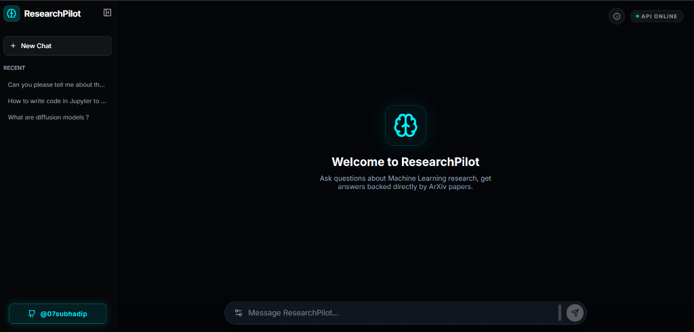

<div align="center">
  

  <br />
  
  <p>
    
    
    
    
    
  </p>

  <br />

  <p>
    <a href="https://research-pilot-ecru.vercel.app"></a>
  </p>
  
  <br />

  <p>
    𝙍𝙚𝙨𝙚𝙖𝙧𝙘𝙝𝙋𝙞𝙡𝙤𝙩 𝙞𝙨 𝙖𝙣 𝙖𝙙𝙫𝙖𝙣𝙘𝙚𝙙 𝙍𝙚𝙩𝙧𝙞𝙚𝙫𝙖𝙡-𝘼𝙪𝙜𝙢𝙚𝙣𝙩𝙚𝙙 𝙂𝙚𝙣𝙚𝙧𝙖𝙩𝙞𝙤𝙣 (𝙍𝘼𝙂) 𝙚𝙣𝙜𝙞𝙣𝙚 𝙙𝙚𝙨𝙞𝙜𝙣𝙚𝙙 𝙨𝙥𝙚𝙘𝙞𝙛𝙞𝙘𝙖𝙡𝙡𝙮 𝙛𝙤𝙧 𝙨𝙮𝙣𝙩𝙝𝙚𝙨𝙞𝙯𝙞𝙣𝙜 𝙖𝙣𝙙 𝙦𝙪𝙚𝙧𝙮𝙞𝙣𝙜 𝙈𝙖𝙘𝙝𝙞𝙣𝙚 𝙇𝙚𝙖𝙧𝙣𝙞𝙣𝙜 𝙡𝙞𝙩𝙚𝙧𝙖𝙩𝙪𝙧𝙚. 𝙄𝙩 𝙞𝙣𝙜𝙚𝙨𝙩𝙨 𝙩𝙝𝙤𝙪𝙨𝙖𝙣𝙙𝙨 𝙤𝙛 𝙨𝙘𝙞𝙚𝙣𝙩𝙞𝙛𝙞𝙘 𝙥𝙖𝙥𝙚𝙧𝙨 𝙛𝙧𝙤𝙢 𝘼𝙧𝙓𝙞𝙫 𝙖𝙣𝙙 𝙖𝙥𝙥𝙡𝙞𝙚𝙨 𝙨𝙩𝙖𝙩𝙚-𝙤𝙛-𝙩𝙝𝙚-𝙖𝙧𝙩 𝙝𝙮𝙗𝙧𝙞𝙙 𝙫𝙚𝙘𝙩𝙤𝙧 𝙨𝙚𝙖𝙧𝙘𝙝𝙞𝙣𝙜 𝙖𝙣𝙙 𝙘𝙧𝙤𝙨𝙨-𝙚𝙣𝙘𝙤𝙙𝙚𝙧 𝙧𝙚𝙧𝙖𝙣𝙠𝙞𝙣𝙜 𝙩𝙤 𝙙𝙚𝙡𝙞𝙫𝙚𝙧 𝙥𝙧𝙚𝙘𝙞𝙨𝙚, 𝙘𝙞𝙩𝙖𝙩𝙞𝙤𝙣-𝙗𝙖𝙘𝙠𝙚𝙙 𝙖𝙣𝙨𝙬𝙚𝙧𝙨. 𝙏𝙝𝙚 𝙨𝙮𝙨𝙩𝙚𝙢 𝙞𝙨 𝙗𝙪𝙞𝙡𝙩 𝙩𝙤 𝙨𝙘𝙖𝙡𝙚 𝙧𝙚𝙡𝙞𝙖𝙗𝙡𝙮 𝙬𝙞𝙩𝙝 𝙖𝙣 𝙞𝙣𝙩𝙚𝙡𝙡𝙞𝙜𝙚𝙣𝙩 𝙢𝙪𝙡𝙩𝙞-𝙢𝙤𝙙𝙚𝙡 𝙇𝙇𝙈 𝙛𝙖𝙡𝙡𝙗𝙖𝙘𝙠 𝙘𝙝𝙖𝙞𝙣.
  </p>
  <br />
</div>

---

## Demo


The ResearchPilot user interface demonstrating conversation memory, LaTeX mathematical rendering, inline citations, and streaming responses from the AI.

## Why ResearchPilot

| Feature | Naive RAG | ResearchPilot |
| :--- | :---: | :---: |
| **Retrieval method** | Standard Dense Vectors | ✅ Hybrid BM25 + Dense Vectors (RRF Fusion) |
| **Re-ranking** | ❌ None | ✅ Cross-Encoder Re-ranking (`ms-marco-MiniLM`) |
| **Chunking strategy** | Fixed-size character splitting | ✅ Semantic chunking at topic boundaries |
| **LLM fallback** | ❌ None (Static Model) | ✅ 4-Model Fallback Chain for failover |
| **Conversation memory** | ❌ Single turn | ✅ Multi-turn with Query Rewriting |
| **Math rendering** | Broken/Raw LaTeX | ✅ Full KaTeX equation rendering |
| **Citation sourcing** | Missing or Hallucinated | ✅ Inline ArXiv citation badges |

## Architecture

```text
User Query 
   │
   ▼
Query Rewriter (Follow-up expansion)
   │
   ▼
Retrieval Layer
   ├── BM25 Sparse Index (Term matching)
   └── Qdrant Dense Index (Semantic matching)
   │
   ▼
Reciprocal Rank Fusion (RRF)
   │
   ▼
Cross-Encoder Reranker
   │
   ▼
Context Compressor
   │
   ▼
LLM Fabric (GLM-5.1 → Qwen-3.5 → LLaMA-3.3 → Qwen-2.5-Coder)
   │
   ▼
Streaming Response
   │
   ▼
Frontend (Next.js + KaTeX)
```

| Component | Technology | Purpose |
| :--- | :--- | :--- |
| **Frontend** | Next.js & React | High-performance user interface with App Router. |
| **Backend** | FastAPI & Pydantic | Asynchronous, highly concurrent API server. |
| **Embeddings** | BAAI/bge-base-en-v1.5 | State-of-the-art 768-dimensional textual embeddings. |
| **Vector DB** | Qdrant (local, CPU) | Fast, scalable persistent storage for deep semantic vectors. |
| **Sparse Index** | rank-bm25 | Token-based matching to locate exact keywords and terms. |
| **Re-ranking** | MiniLM-L-6-v2 | High-fidelity scoring of retrieved contexts against the query. |
| **Generation** | Multiple LLMs | Dynamic routing via HuggingFace Inference to ensure high availability. |

## Tech Stack

### Backend
| Component | Technology | Purpose |
| :--- | :--- | :--- |
| Language | Python 3.10+ | Core language for ML applications and data processing |
| Framework | FastAPI & Uvicorn | High performance API and async web serving |
| Embeddings | SentenceTransformers | Dense vector generation (BGE-base-en-v1.5) |
| Vector Store| Qdrant | Vector indexing and semantic retrieval |
| Search | rank-bm25 | Sparse lexical retrieval |
| Re-ranker | Cross-Encoder | Secondary ranking of retrieved contexts |

### Frontend
| Component | Technology | Purpose |
| :--- | :--- | :--- |
| Framework | Next.js (App Router) | React application framework |
| Styling | Tailwind CSS | Utility-first responsive design |
| Animations| Framer Motion | Smooth UI rendering and layout transitions |
| Markdown | react-markdown | Rendering LLM text outputs securely |
| Mathematics| KaTeX & rehype-katex | Native rendering for complex mathematical equations |

## Project Structure

```text
researchpilot/
├── src/
│   ├── ingestion/      # ArXiv API fetcher, PDF downloader
│   ├── processing/     # PDF extractor, text cleaner, chunker
│   ├── embeddings/     # BGE embedding model, cache, pipeline
│   ├── vectorstore/    # Qdrant store, BM25 store, indexer
│   ├── retrieval/      # Hybrid retriever, reranker, pipeline
│   ├── rag/            # RAG pipeline, LLM client, prompts
│   └── api/            # FastAPI app, routes, schemas
├── frontend-next/      # Next.js frontend
├── config/             # Settings, environment config
├── data/               # Chunks, embeddings, Qdrant DB (gitignored)
├── logs/               # Application logs
├── Dockerfile          # HuggingFace Spaces deployment
└── run_*.py            # Pipeline runner scripts
```

## Local Setup

### Prerequisites
- Python 3.10+
- Node.js 18+
- Git

### Installation Steps

1. Clone the repository:
   ```bash
   git clone https://github.com/Subhadip007/ResearchPilot.git
   cd ResearchPilot
   ```

2. Create and activate a Python virtual environment:
   ```bash
   python -m venv venv
   source venv/bin/activate  # On Windows use: venv\Scripts\activate
   ```

3. Install backend dependencies:
   ```bash
   pip install -r requirements.txt
   ```

4. Configure environment variables:
   Copy `.env.example` to `.env` and fill in your API keys:
   ```bash
   cp .env.example .env
   ```
   Add your `GROQ_API_KEY` and `HF_API_KEY`.

5. Run the data ingestion and indexing pipeline:
   *(Note: The full pipeline takes several hours on the first run. For skipping this, see the HF Dataset note below).*
   ```bash
   python run_ingestion.py
   python run_chunking.py
   python run_embedding.py
   python run_indexing.py
   ```

6. Start the FastAPI backend:
   ```bash
   python run_api.py
   ```

7. Start the Next.js frontend (in a new terminal):
   ```bash
   cd frontend-next
   npm install
   npm run dev
   ```

8. Open the application: 
   Navigate to [http://localhost:3000](http://localhost:3000)

*Note: Pre-built vectorized data can be downloaded directly from the Hugging Face Dataset [Subhadip007/researchpilot-data](https://huggingface.co/datasets/Subhadip007/researchpilot-data) to skip step 5.*

## Pipeline Scripts

| Script | Purpose | Runtime (approx) |
| :--- | :--- | :--- |
| `run_ingestion.py` | Fetch papers from ArXiv + download PDFs | ~10 min / 100 papers |
| `run_chunking.py` | Semantic chunking with BGE embeddings | ~45 min to 1 hr (Kaggle GPU) / 3000 papers |
| `run_embedding.py` | Generate 768-dim embeddings for all chunks | ~1.5 hrs (Kaggle GPU) |
| `run_indexing.py` | Index embeddings into Qdrant | ~2 min |
| `run_api.py` | Start FastAPI server | Instant |

## API Reference

```json
POST /query
Body: 
{ 
  "question": "string", 
  "history": [], 
  "top_k": 5,
  "filter_category": "cs.LG", 
  "filter_year_gte": 2024 
}
Returns: 
{ 
  "answer": "string", 
  "citations": ["1234.56789"], 
  "total_time_ms": 1245.5 
}
```

```json
GET /health
Returns: 
{ 
  "status": "healthy", 
  "vector_db_size": 15664 
}
```

```json
POST /feedback
Body: 
{ 
  "query": "string", 
  "rating": 5, 
  "comment": "string" 
}
Returns:
{
  "status": "ok"
}
```


## How Retrieval Works

- Hybrid search: BM25 finds exact keyword matches, while BGE finds deep semantic textual matches.
- RRF fusion: Ranks from sparse and dense retrievers are combined using the `1/(k+rank)` formulation, rather than raw score addition.
- Two-stage retrieval: The top-40 candidates are retrieved cheaply via vector database, then the top-10 are strictly re-scored by a powerful cross-encoder.
- Semantic chunking: Documents are split intelligently at topic boundaries by tracking sentence similarity drops, preventing concept shearing.
- Query rewriting: Conversational follow-up questions are automatically expanded using history to ensure the vector database always receives full context.

## Deployment

### Backend Server
The backend is Dockerized and deployed continuously to Hugging Face Spaces. It runs on internal port 7860. To stay within storage limits, pre-processed vector chunks are automatically restored from a Hugging Face Dataset during component startup.

### Frontend Application
The Next.js frontend is deployed via Vercel. It relies on the environment variable `NEXT_PUBLIC_API_URL` to route requests to the Hugging Face Space.

*Note: Hugging Face Spaces on the free tier automatically go to sleep after 48 hours of inactivity. The machine will cold-start temporarily upon the next interaction, but active usage keeps the hardware fully awake and responsive.*

## Roadmap

- [x] Hybrid BM25 + dense retrieval
- [x] Cross-encoder re-ranking
- [x] Multi-turn conversation memory
- [x] Streaming responses
- [x] Multi-model LLM fallback chain
- [x] KaTeX mathematical rendering
- [ ] Scale to 10,000+ papers
- [ ] RAGAS evaluation framework with benchmark scores
- [ ] Multimodal: figure and chart understanding
- [ ] User authentication and personal conversation history

## Contributing

Contributions and Pull Requests are welcome. However, please open an issue first to discuss any major architectural changes before submitting code.

## License

This project is licensed under the Apache License 2.0 - Copyright 2026 Subhadip Hensh.

---

<div align="center">
  
  
  <h3>✨ Built with ❤️ by Subhadip Hensh ✨</h3>
  <br/>
  <a href="https://research-pilot-ecru.vercel.app"></a>
  <a href="https://www.linkedin.com/in/subhadip-hensh/"></a>
  <a href="https://github.com/subhadip07"></a>
  <br/><br/>
</div>
